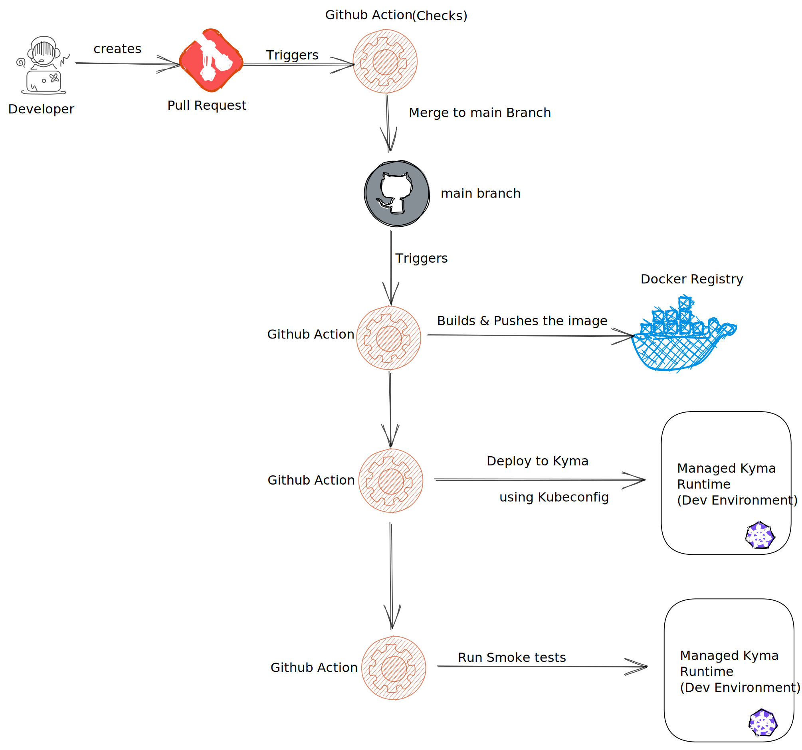
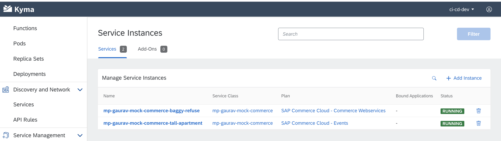
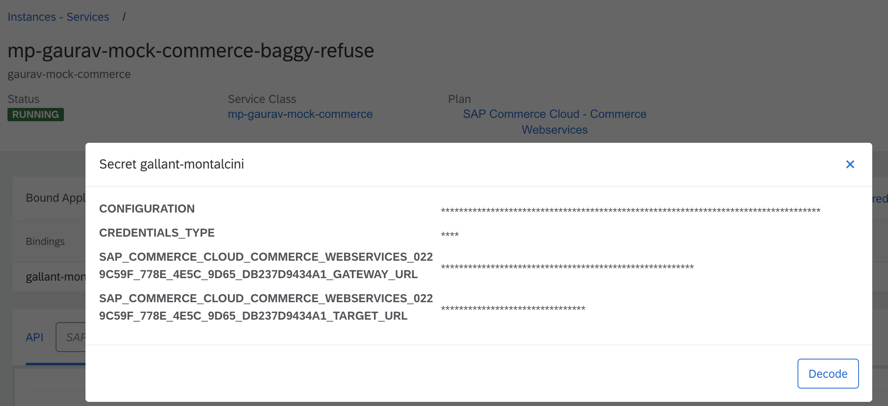
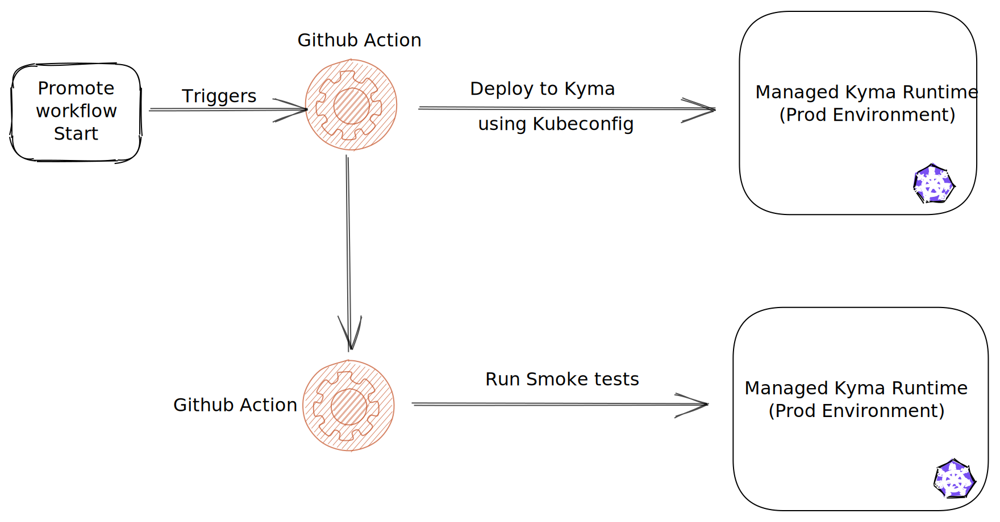
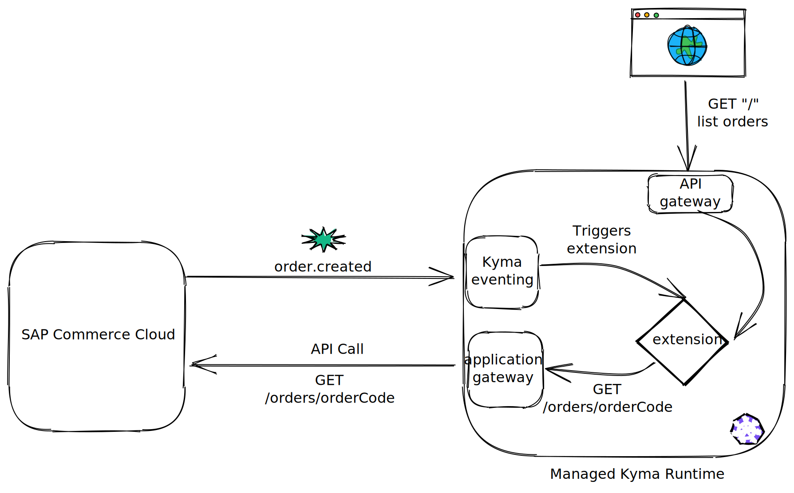
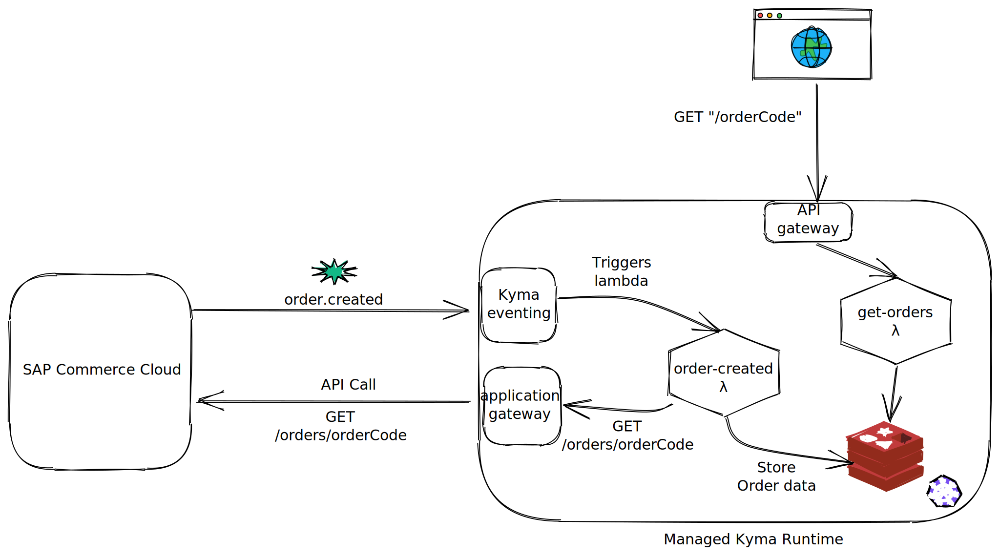

[](https://api.reuse.software/info/github.com/SAP-samples/btp-kyma-runtime-ci-cd)

# Building CI CD Pipelines for Kyma runtime extensions and applications

## Description

With more & more developers building extensions and applications using [SAP BTP, Kyma runtime](https://blogs.sap.com/2020/05/12/get-a-fully-managed-runtime-based-on-kyma-and-kubernetes/), it is but natural to implement CI-CD flows.

As a developer, I would like to ensure,

- Code quality of my Kyma functions and microservices.
- All checks related to code styling, security best practices are followed
- Sufficient code coverage to have confidence in the production deployments
- Fewer surprises and fewer breaking changes

I would like to have **seamless automated deployments**

- Creation of assets such as docker images
- Functions & microservices are automatically deployed to my desired Kyma environment and namespace.
- All necessary configurations are also applied
- My Source control (e.g Git) to be source of truth for all my deployments.

Below is a example flow using Github actions (which can be easily replaced by any other similar service such as Jenkins)

This repository contains the assets and source code referring to [this blog post](https://blogs.sap.com/2021/02/12/building-ci-cd-pipelines-for-kyma-runtime-extensions-and-applications/).

## Developer CI CD Flow



The initial part is a standard PR flow where certain checks are performed for a PR to ensure it can be safely merged to main branch.

Post merge, the assets (in this case docker images) are created for microservices and pushed to docker registry.

Functions are configured using [Kyma GitRepository feature](https://kyma-project.io/docs/components/serverless/#tutorials-create-a-function-from-git-repository-sources) which automatically pulls the source code and updates the running function.

## Requirements

- SAP Cloud Platform, Kyma runtime
- SAP Commerce Cloud system connected to the Kyma runtime. You can also use the mock. Refer to [this blog post](https://blogs.sap.com/2020/06/17/sap-cloud-platform-extension-factory-kyma-runtime-mock-applications/) to set up the commerce mock.
- Not-expiring Kubeconfig for dev and prod environments. They are obtained by following the instructions [kubeconfig-for-sa](https://github.com/kyma-incubator/examples/tree/master/kubeconfig-for-sa)
- Docker Account and generated Docker token.
- Namespaces have been created for prod and dev environments.
- SAP Commerce cloud Kyma application has been bound to the namespaces.

## Deploying the pipeline

- Clone [this github repository](https://github.com/SAP-samples/btp-kyma-runtime-ci-cd)
- Provide the content for Kubeconfigs for Dev and production environment as Secrets under github repo --> settings --> secrets with name `DEV_KUBECONFIG` and `PROD_KUBECONFIG` respectively
- Provide `DOCKER_ACCOUNT` and `DOCKER_TOKEN`. They are used for building and pushing the image to your docker repository.

### Deploying to Dev

Deployment resources are defined as [Helm-charts](https://helm.sh/) which are available under [k8s-resources](./k8s-resources/README.md)

Deployment to a dev landscape is done via the Github workflow [deploy-to-dev](.github/workflows/deploy-to-dev.yml)

Any dev landscape specific configuration is provided in the [values-dev.yaml](k8s-resources/values-dev.yaml).

For any confidential data, it is possible to create secrets and use environment variables with Github workflow.

The not-expiring Kubeconfigs are obtained following the instructions [kubeconfig-for-sa](https://github.com/kyma-incubator/examples/tree/master/kubeconfig-for-sa)

It uses various actions from Microsoft azure to set up the Kubernetes environment such as:

- Setting the K8S context
- Setting up Helm

The `KUBECONFIG` is configured safely as an environment secret in the repository settings.

Below are the steps in **deploy-to-dev** workflow.

```yaml
jobs:
  # This workflow contains a single job called "build"
  deploy-to-dev:
    # The type of runner that the job will run on
    runs-on: ubuntu-latest
    # Steps represent a sequence of tasks that will be executed as part of the job
    steps:
      # Checks-out your repository under $GITHUB_WORKSPACE, so your job can access it
      - uses: actions/checkout@v2
      - uses: azure/k8s-set-context@v1
        with:
          method: kubeconfig
          kubeconfig: ${{ secrets.DEV_KUBECONFIG }}
      - uses: azure/setup-helm@v1
        with:
          version: 'v3.5.1'
      - name: Helm Deployment
        working-directory: k8s-resources
        run: helm upgrade k8s-resources . -f ./values-dev.yaml --install
      - name: Run smoke tests on dev environment
        run: echo "running smoke tests"
```

The workflow will deploy the workloads as well all the necessary configurations such as:

- API Rules
- ServiceBindingUsage
- K8s Deployments, Services
- Event Triggers
- and any other required resources.

The only exception is to create the Service Instances for required services and events. For Services, Secrets are also required to be created. In the future releases, these manuals steps will also be obviated.




The corresponding details then need to (secret name and gateway url variable name), then needs to configured in [values-dev.yaml](k8s-resources/values-dev.yaml) & [values-prod.yaml](k8s-resources/values-prod.yaml) for dev and prod landscapes respectively.

## Promote to production



The workflow to promote to production is very similar to the one used for deploying to dev landscape.
The only differences are it uses a different kubeconfig and [values-prod.yaml](k8s-resources/values-prod.yaml) for helm installation.

## Deployed Samples

The deployed samples demonstrate a typical extension scenario.

Extension or function is triggered based on an event (order.created) from a SAP system (in this case, mock SAP Commerce Cloud). The logic then retrieves the order details by making an API call via API gateway & stores it.
The stored details are then available an API exposed using API Rule.

### Extension



## Functions



## Known Issues

The samples are provided on the "as-is" basis. Currently, there are no known issues for the sample projects.

## How to obtain support

[Create an issue](https://github.com/SAP-samples/btp-kyma-runtime-ci-cd/issues) in this repository if you find a bug or have questions about the content.

For additional support, [ask a question in SAP Community](https://answers.sap.com/questions/ask.html).

## License

Copyright (c) 2021 SAP SE or an SAP affiliate company. All rights reserved. This project is licensed under the Apache Software License, version 2.0 except as noted otherwise in the [LICENSE](LICENSES/Apache-2.0.txt) file.
