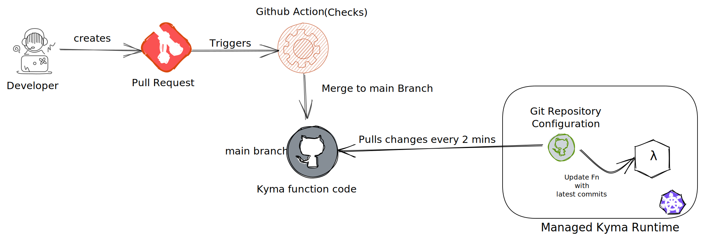

[](https://codecov.io/gh/abbi-gaurav/ci-cd-kyma)

# CI/CD with Kyma Functions



## What are we trying to acheive?

**Build a test pipeline for my Kyma functions**

As a developer, I would like to ensure

- Code quality of my Kyma funtions
- All checks related to code styling, security best practices are followed
- Sufficient code covergae to have confidence in the production deployments
- Fewer surprises and fewer breaking changes

**Seamlessly delploy my Kyma functions**

I would like to have

- An automated way of deploying my Kyma funcions
- No manual changes or deployments
- My Source control (e.g Git) to be source of truth for all my deployments.

## Continous Delivery using Kyma GitRepository

Since version 1.17, Kyma has introduced the concept of [Git repository as a source for your Function](https://kyma-project.io/blog/2020/12/1/release-notes-117/#serverless). This implies that one can configure a Git repository in Kyma which can be used as a source of code for one or more Kyma functions. You can read about it more in the link <https://kyma-project.io/blog/2020/12/1/release-notes-117/#serverless>

## Build and test pipeline

One can set up a pipeline using one of the various CI tools avaialble (Jenkins, CirceCI, GitHub Actions and so on). The pipeline can perform tests and various checks to ensure all requirements to have high quality code are met. For refernce, I am using Github Actions in the sample.

## Reference Sample

- The sample is a nodejs project containing 2 Kyma functions.
  
  - `order-created` : Triggered with order-created event. It then fetches the order data from commerce and stores the order data in a redis database
  - `get-order` : Provides and API to get an Order data for a given order code. Exposed via API rule

- Standard nodejs frameworks mocha, chai are used for testing.

The project/repository structure looks as below:

```shell
.
├── coverage
├── test
├── functions
├── node_modules
├── package-lock.json
├── package.json
├── assets
├── k8s
└── README.md
```

`functions` contain all the Kyma functions implemented in nodejs12

```shell
functions
├── get-orders
│   ├── package.json
│   └── handler.js
└── order-created
    ├── package.json
    └── handler.js

2 directories, 4 files
```

**Running the tests with coverage**

`test` directort contains the tests

To run the test locally,

```shell
BASE_SITE=electronics GATEWAY_URL=https://mock.commerce.gateway npm run test-with-coverage
```

The same has been incorporated into the  with [github actions](.github/workflows/main.yml).


For a developer, creating a PR, the same checks are run and only after they pass, the changes can be merged to `main`. And with `Kyma GitRepository`, they are are automatically deployed to the Kyma runtime.


## Deploying the sample

### Prerequisites

- Commerce connected to the Kyma runtime. One can also set up the [mock](https://blogs.sap.com/2020/06/17/sap-cloud-platform-extension-factory-kyma-runtime-mock-applications/)
- The connected System bound to a Kyma namespace.
- Service Instance has been created for OCC APIs and events.
- Servcie credentials have been created for the OCC APIs.

### Steps

To deploy the sample in your Kyma runtime

- Fork this reposiroty.
- Create up GitRepository object pointing to your forked repository. Update the [GitRepository](k8s/repo.yaml) file with your github repository.

    ```yaml
    apiVersion: serverless.kyma-project.io/v1alpha1
    kind: GitRepository
    metadata:
    name: kyma-functions-repo
    spec:
    url: "https://github.com/abbi-gaurav/ci-cd-kyma-functions.git" #update the repo
    ```

    ```shell
    kubectl -n development apply -f k8s/repo.yaml
    ```

- Create Redis DB. A redis DB deployed on Kyma is used fot this sample. Not recommended for productive scenarios. Use one of the Hyperscaler offerings via Kyma Broker Addons.

    ```shell
    kubectl -n development apply -f k8s/redis.yaml
    ```

- Deploy the `order-created` function. Make the necessary changes in the [order-created yaml](k8s/functions/order-created.yaml
  - Update the `BASE_SITE` for your commerce cloud environment.
  - Update the connected system name as it appears in your Kyma runtime.
  - Update name of the credential created in Service catalog for OCC API
  - Update the `GATEWAY_URL` value as in your created credentials.

  - As you can see, the Kyma function refers to the git reposirory and directory path.

    ```yaml
    apiVersion: serverless.kyma-project.io/v1alpha1
    kind: Function
    metadata:
    name: order-created-trigger
    spec:
    type: git
    runtime: nodejs12
    source: kyma-functions-repo
    reference: main
    baseDir: functions/order-created
    env:
    - name: REDIS_HOST
        value: kyma-ci-cd-redis
    - name: REDIS_PORT
        value: "6379"
    - name: "BASE_SITE"
        value: electronics #change it if you have different base site
    - name: "GATEWAY_URL"
        value: "$(SAP_COMMERCE_CLOUD_COMMERCE_WEBSERVICES_D2E07775_87FA_43B5_923D_189459F0C934_GATEWAY_URL)" #update the name as in your created credential
    ```

  - Deploy the function

    ```shell
    kubectl -n development apply -f k8s/functions/order-created.yaml
    ```
  
  - It also creates a `ServiceBindingUsage` to use the service instance credentials and an `Event Trigger` for order-created event.

- Deploy the `get-orders` fucntion as well as the API rule to expose it over internet. It has similiar function defintion.

    ```shell
    kubectl -n development apply -f k8s/functions/order-created.yaml
    ```
